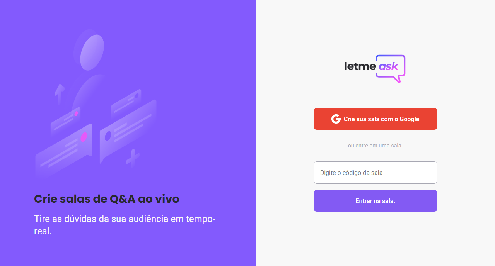

<div align="center">
</img>
</div>

<hr>
 <h1 align="center"><strong>Letmeask by Rocketseat</strong></h1>

<br>
<p align="center">
  <a href="#-project">Project</a>&nbsp;&nbsp;&nbsp;|&nbsp;&nbsp;&nbsp;
  <a href="#installation">Installation</a>&nbsp;&nbsp;&nbsp;|&nbsp;&nbsp;&nbsp;
  <a href="#-technologies">Technologies</a>
</p>

<br>

### This is a project was developed in NLW together and teach by Diego Fernandes.

<br>

## 💻 Project

<p>This application you can make a room. And you can see questions and to answer.</p>

<br>

<br>
<br>

<p>
For you see this web app. Just click <a href='https://letmeask-nlw-d354d.web.app/'>here</a>
</p>

## Installation

- Important: You must have installed the Node.js and Git

```bash
# clone it
$ git clone https://github.com/Wesley-AlvesRolim/NLW-Together-ReactJS.git

# Install dependencies
$ yarn

# Running script
$ yarn start
```

- And enter in your browser using http://localhost:3000

## 🚀 Technologies

This project was developed using the following technologies:

- <code></code>

- <code></code>

- <code></code>
